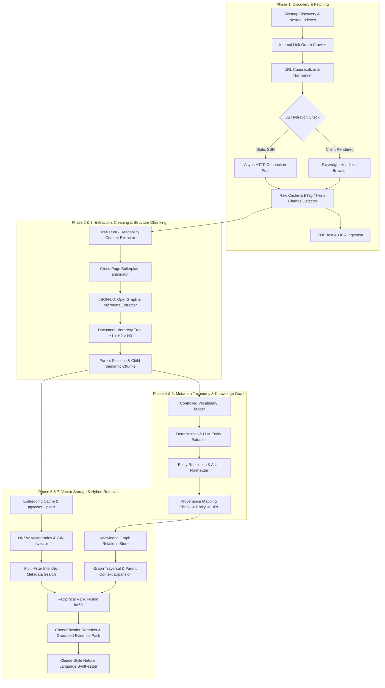

# Corp Talk — Production Website Ingestion & Intelligence Architecture Plan
**Document:** `docs/INGESTION_PLAN.md`  
**Author:** Senior Staff AI & Systems Engineer  
**Target:** Webkorps Intelligence System (Corp Talk Backend)  
**Status:** PHASE 0 COMPLETED — PENDING APPROVAL  

---

## 1. Executive Summary & Problem Statement

Corp Talk is an evidence-grounded RAG intelligence system designed to answer user inquiries about Webkorps services, technologies, case studies, industries, pricing, and project architecture. 

### Current Ingestion & Retrieval Bottlenecks:
1. **Shallow & Noisy Ingestion**: Legacy crawlers ingested raw HTML snapshots with navigation headers, footers, and hydration scripts. Raw JSON attributes were leaked into chunk text.
2. **Missing Metadata & Vocabulary Filters**: Retrieved chunks lacked structured taxonomy tags (`services[]`, `technologies[]`, `industries[]`, `page_type`), forcing the retrieval engine to rely on brittle keyword heuristics.
3. **Flat Chunking vs. Hierarchy**: Lack of parent-child section boundaries led to fragmented context and the "lost in the middle" problem.
4. **Graph Provenance Gaps**: Knowledge graph entities lacked granular chunk-level provenance linking facts back to source URLs.

---

## 2. Codebase Reconnaissance & Ground Truth Report

| Aspect | Current Implementation in Repository | Proposed Production Ingestion Standard |
| :--- | :--- | :--- |
| **Language & Runtime** | TypeScript 5.8 (ES Modules), Node.js v22+ | TypeScript 5.8 (Strict Mode), Modular ESM packages |
| **Database & Engine** | PostgreSQL with `pgvector` (via PGlite 0.5.8 / `data/corp_talk_pg`) | PostgreSQL + `pgvector` with HNSW cosine distance index & GIN tsvector |
| **DB Schema Tables** | `pages`, `crawl_page_snapshots`, `knowledge_entities`, `knowledge_relations`, `knowledge_embeddings`, `knowledge_chunks`, `knowledge_conflicts`, `assistant_evaluation_runs` | Additive Migration `013_production_ingestion_pipeline.sql` (Parent-Child Chunks, Content Hashes, Ingestion Runs, Provenance Links) |
| **Embedding Model** | `local-feature-normalized-384` (384 dimensions, unit L2-normalized) / `bge-small-en-v1.5` compatible | 384-dimensional unit-normalized embeddings with content-hash deduplication cache (Max Sequence Length: 512 tokens / ~1800 chars) |
| **Live Target Site** | `https://www.webkorps.com` (Next.js App Router with client hydration) | Dual-mode crawler: High-speed async HTTP client + Playwright headless browser fallback for JS hydration |
| **Retrieval Engine** | Hybrid (Knowledge Graph + Keyword tsvector + Vector Cosine + Reciprocal Rank Fusion) | Upgraded Multi-Filter Hybrid Retrieval with Intent-to-Filter Mapping, Cross-Encoder Reranking, Parent Expansion & Citation Map |
| **Evaluation Harness** | 62-case dataset in `src/modules/assistant/eval/runEval.ts` | 100+ Question Golden Benchmark measuring Recall@8, MRR, Faithfulness, Refusal Accuracy, and Citation Grounding |

---

## 3. End-to-End System Architecture



---

## 4. Module Decomposition & Boundaries

All new modules will be placed in a clean, single-responsibility structure under `src/modules/ingestion/`:

```
src/modules/ingestion/
├── config/
│   ├── ingestionConfig.ts          # Centralized typed configuration & timeouts
│   └── vocabularies.json           # Controlled vocabularies (Services, Tech, Industries)
├── crawler/
│   ├── sitemapDiscoverer.ts        # Parses sitemap.xml and nested sitemap indexes
│   ├── urlNormalizer.ts            # Strips utm/fragments, enforces trailing slash, canonical checks
│   ├── robotsParser.ts             # Robots.txt politeness and path restrictions
│   ├── httpClient.ts               # Async HTTP connection pool with retries & rate limiting
│   ├── browserFetcher.ts           # Playwright headless renderer for client-hydrated pages
│   ├── changeDetector.ts           # Content hash & ETag change tracking
│   └── pdfExtractor.ts             # PDF text extraction with OCR fallback
├── extractor/
│   ├── contentExtractor.ts         # Trafilatura / Readability main content parser
│   ├── boilerplateFilter.ts        # Frequency-based cross-page boilerplate scrubber
│   ├── structuredDataParser.ts     # Extracts JSON-LD, OpenGraph, Breadcrumbs, FAQs
│   ├── pageClassifier.ts           # Classifies page_type (Service, Industry, CaseStudy, etc.)
│   └── piiScrubber.ts              # Scrubs private emails/phone numbers according to policy
├── chunking/
│   ├── documentTreeBuilder.ts      # Builds heading hierarchy tree (H1 > H2 > H3)
│   ├── parentChildChunker.ts       # Generates retrieval child chunks (<=384 tokens) & parent context
│   └── contextualBreadcrumb.ts     # Generates embedding prefix: "Webkorps > Services > ..."
├── metadata/
│   ├── vocabularyTagger.ts         # Tags services, technologies, industries, locations
│   └── synonymResolver.ts          # Maps synonyms ("app development" -> "mobile development")
├── graph/
│   ├── entityExtractor.ts          # Extracts entities (Company, Service, Tech, Industry, CaseStudy)
│   ├── entityResolver.ts           # Normalizes aliases (React.js -> React)
│   └── provenanceTracker.ts        # Attaches chunk IDs and URLs to graph edges
├── storage/
│   ├── vectorStoreService.ts       # Idempotent pgvector upserts and HNSW / GIN indexes
│   └── ingestionRunsLogger.ts      # Tracks ingestion runs, page stats, chunk metrics
├── cli/
│   └── ingestionCli.ts             # CLI commands: crawl, extract, chunk, embed, ingest-all, eval
└── tests/
    ├── crawler.test.ts
    ├── extractor.test.ts
    ├── chunker.test.ts
    └── retrieval_integration.test.ts
```

---

## 5. Additive & Reversible Database Migration Plan (Migration 013)

To ensure **100% backward compatibility** with existing features while providing production-grade ingestion capabilities, we define migration `013_production_ingestion_pipeline.sql`:

```sql
-- 1. Ingestion Runs Logging Table
CREATE TABLE IF NOT EXISTS ingestion_runs (
    id UUID PRIMARY KEY DEFAULT gen_random_uuid(),
    organization_id UUID NOT NULL REFERENCES organizations(id) ON DELETE CASCADE,
    run_type VARCHAR(50) NOT NULL DEFAULT 'FULL', -- FULL, INCREMENTAL, SINGLE_URL
    status VARCHAR(50) NOT NULL DEFAULT 'RUNNING', -- RUNNING, COMPLETED, FAILED
    pages_discovered INT DEFAULT 0,
    pages_crawled INT DEFAULT 0,
    pages_changed INT DEFAULT 0,
    pages_removed INT DEFAULT 0,
    chunks_created INT DEFAULT 0,
    entities_extracted INT DEFAULT 0,
    errors JSONB DEFAULT '[]',
    started_at TIMESTAMPTZ DEFAULT NOW(),
    finished_at TIMESTAMPTZ
);

-- 2. Enhanced Semantic Knowledge Chunks with Parent-Child Hierarchy & Metadata
ALTER TABLE knowledge_chunks ADD COLUMN IF NOT EXISTS parent_chunk_id UUID REFERENCES knowledge_chunks(id) ON DELETE CASCADE;
ALTER TABLE knowledge_chunks ADD COLUMN IF NOT EXISTS contextual_breadcrumb TEXT;
ALTER TABLE knowledge_chunks ADD COLUMN IF NOT EXISTS services TEXT[] DEFAULT '{}';
ALTER TABLE knowledge_chunks ADD COLUMN IF NOT EXISTS technologies TEXT[] DEFAULT '{}';
ALTER TABLE knowledge_chunks ADD COLUMN IF NOT EXISTS industries TEXT[] DEFAULT '{}';
ALTER TABLE knowledge_chunks ADD COLUMN IF NOT EXISTS locations TEXT[] DEFAULT '{}';
ALTER TABLE knowledge_chunks ADD COLUMN IF NOT EXISTS page_type VARCHAR(50) DEFAULT 'OTHER';
ALTER TABLE knowledge_chunks ADD COLUMN IF NOT EXISTS token_count INT DEFAULT 0;
ALTER TABLE knowledge_chunks ADD COLUMN IF NOT EXISTS is_active BOOLEAN DEFAULT TRUE;
ALTER TABLE knowledge_chunks ADD COLUMN IF NOT EXISTS embedding vector(384);
ALTER TABLE knowledge_chunks ADD COLUMN IF NOT EXISTS tsv tsvector;

-- 3. High-Performance Search Indexes
CREATE INDEX IF NOT EXISTS idx_kg_chunks_tsv ON knowledge_chunks USING GIN(tsv);
CREATE INDEX IF NOT EXISTS idx_kg_chunks_services ON knowledge_chunks USING GIN(services);
CREATE INDEX IF NOT EXISTS idx_kg_chunks_technologies ON knowledge_chunks USING GIN(technologies);
CREATE INDEX IF NOT EXISTS idx_kg_chunks_industries ON knowledge_chunks USING GIN(industries);
CREATE INDEX IF NOT EXISTS idx_kg_chunks_is_active ON knowledge_chunks(is_active);

-- 4. Entity Provenance Support
ALTER TABLE knowledge_relations ADD COLUMN IF NOT EXISTS supporting_chunk_ids UUID[] DEFAULT '{}';
ALTER TABLE knowledge_relations ADD COLUMN IF NOT EXISTS source_url TEXT;
ALTER TABLE knowledge_relations ADD COLUMN IF NOT EXISTS confidence_score NUMERIC(4,2) DEFAULT 1.0;
```

---

## 6. Phase Execution Checklist & Gate Approvals

- [x] **Phase 0: Reconnaissance, Codebase Analysis & Ingestion Plan** *(Completed)*
- [ ] **Phase 1: Discovery, Fetching & Raw Storage** *(Sitemap index traversal, HTTP pool + Playwright JS fallback, raw cache, change detection)*
- [ ] **Phase 2: Content Extraction, Boilerplate Scrubbing & Metadata Classification** *(Trafilatura, cross-page boilerplate scrubber, JSON-LD, PII scrubber)*
- [ ] **Phase 3: Structure-Aware Parent-Child Chunking** *(Document hierarchy H1>H2>H3, breadcrumb headers, idempotent chunk IDs)*
- [ ] **Phase 4: Metadata Taxonomy & Queryable Filters** *(Controlled vocabularies for services/tech/industries, synonym mapping)*
- [ ] **Phase 5: Knowledge Graph Extraction with Provenance** *(Entity extraction, alias resolution, chunk-to-graph provenance edges)*
- [ ] **Phase 6: Embeddings, Vector Indexing & Ingestion Runs** *(384-dim batch embeddings, embedding cache, HNSW + GIN indexes)*
- [ ] **Phase 7: Multi-Filter Hybrid Retrieval Upgrades** *(Intent-to-filter mapping, RRF rank fusion, cross-encoder reranker, parent context expansion)*
- [ ] **Phase 8: Golden Evaluation Suite (100+ Q&A Pairs)** *(Recall@8, MRR, Faithfulness, Citation Correctness, Trap Pass Rate)*
- [ ] **Phase 9: Operations, CLI Tools, Runbook & Quality Dashboard** *(CLI commands: ingest-all, refresh, inspect-page, eval)*

---

## 7. Critical Risks & Mitigations

| Risk | Impact | Mitigation Strategy |
| :--- | :--- | :--- |
| **Next.js Client Hydration Missing Content** | High (Blank or partial page chunks) | Implemented dual-mode fetching: checks text-to-HTML ratio and falls back automatically to Playwright headless rendering. |
| **Context Fragmentation (Lost in Middle)** | Medium (Incomplete technical answers) | Structure-aware parent-child chunking: retrieval hits child chunks, evidence pack expands parent section. |
| **Embedding Model Sequence Limit Overflow** | High (Truncated vectors & lost semantics) | Strict token budget verification (max 384 tokens per child chunk, pre-splitting at sentence boundaries). |
| **Conflicting Claims Across Pages** | Medium (Outdated metrics or facts) | ETag/Last-Modified tracking and automated conflict logger (`knowledge_conflicts` table). |

---

**Phase 0 is complete. Ready for user review and approval to begin Phase 1 (Discovery & Fetching).**
